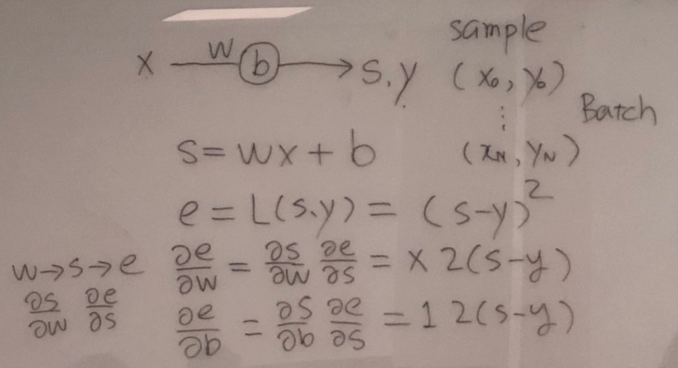
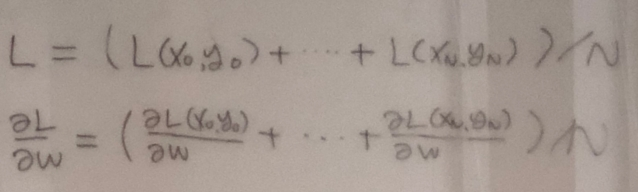

# Feed-forward Neural Network

## problem definition

## Custom FNN 구현 ([code](./07 custom FNN 0.py))

### for one sample (x, y)

- s = wx + b
- e = (s - y)^2
- de/dw = ds/dw * de/ds = x * 2(s-y)
- de/db = ds/db * de/ds = 1 * 2(s-y)

### for batch samples

- (grad_w, grad_b) = average(de/dw, de/db) over samples in batch
- because loss function for the batch is the average of the loss of each sample

### update

- w -= grad_w * learning_rate
- b -= grad_b * learning_rate
