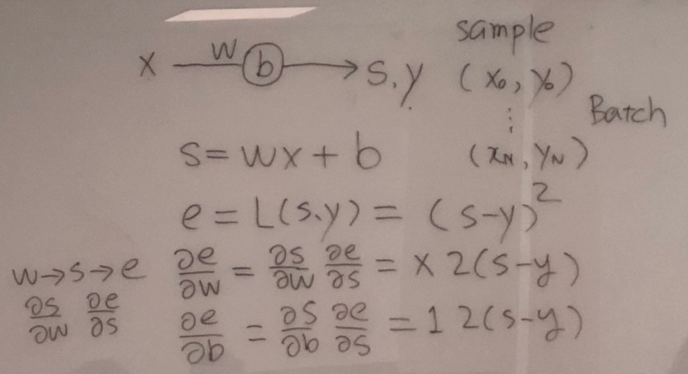
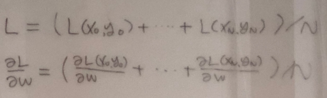
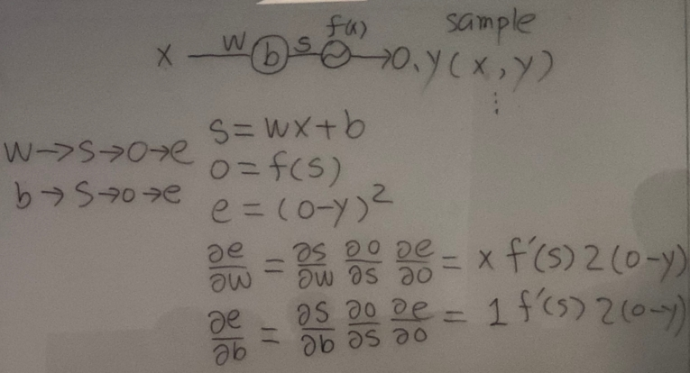
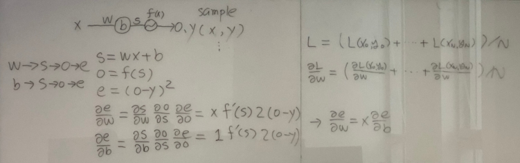
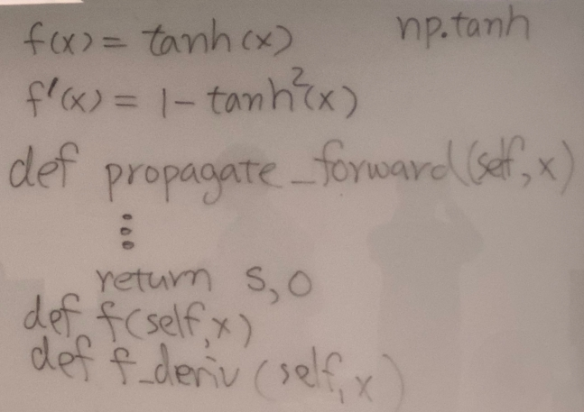

# Feed-forward Neural Network

## problem definition(without activation)

- 입력 x에 대해, w와 b가 독립적으로 변화한다.
- w와 b의 변화는 편미분에 의해 구할 수 있다.(두 변수는 독립적으로 변화하지만 동시에 변경해야 한다.)
- 에러는 MSE(Mean Square Error)를 사용한다.

- N개의 입력(배치)에 대한 Loss 는 각각의 입력에 대한 Loss 의 평균으로 계산할 수 있다.

## Custom FNN 구현(without activation) ([code](./07 custom FNN 0.py))

### for one sample (x, y)

- s = wx + b
- e = (s - y)^2
- de/dw = ds/dw * de/ds = x * 2(s-y)
- de/db = ds/db * de/ds = 1 * 2(s-y)

### for batch samples

- (grad_w, grad_b) = average(de/dw, de/db) over samples in batch
- because loss function for the batch is the average of the loss of each sample

### update

- w -= grad_w * learning_rate
- b -= grad_b * learning_rate

## problem definition(with activation)

- activation function 은 o = f(s) 라 가정한다. 

- de/dw = x * de/db

- activation function 을 tanh 를 이용한다. ( np.tanh() 이용 )
    - f(s) = tanh(s)
    - $f\prime(s) = 1 - tanh^2(s)$
- forward 계산을 위한 propagate_forward() 함수를 정의 한다.

## Custom FNN 구현(with activation) ([code](./07 custom FNN 1.py))
