# Feed-forward Neural Network

## problem definition(without activation)

- 입력 x에 대해, w와 b가 독립적으로 변화한다.
- w와 b의 변화는 편미분에 의해 구할 수 있다.(두 변수는 독립적으로 변화하지만 동시에 변경해야 한다.)
- 에러는 MSE(Mean Square Error)를 사용한다.

- N개의 입력(배치)에 대한 Loss 는 각각의 입력에 대한 Loss 의 평균으로 계산할 수 있다.

## Custom FNN 구현(without activation) ([code](07%20custom%20FNN%200.py))

### for one sample (x, y)

- s = wx + b
- e = (s - y)^2
- de/dw = ds/dw * de/ds = x * 2(s-y)
- de/db = ds/db * de/ds = 1 * 2(s-y)

### for batch samples

- (grad_w, grad_b) = average(de/dw, de/db) over samples in batch
- because loss function for the batch is the average of the loss of each sample

### update

- w -= grad_w * learning_rate
- b -= grad_b * learning_rate

## problem definition(with activation)

- activation function 은 o = f(s) 라 가정한다. 

- de/dw = x * de/db

- activation function 을 tanh 를 이용한다. ( np.tanh() 이용 )
  - f(s) = tanh(s)
  - $f\prime(s) = 1 - tanh^2(s)$
- forward 계산을 위한 propagate_forward() 함수를 정의 한다.

## Custom FNN 구현(with activation) ([code](07%20custom%20FNN%201.py))

## 다층 FNN

- Back Propagation

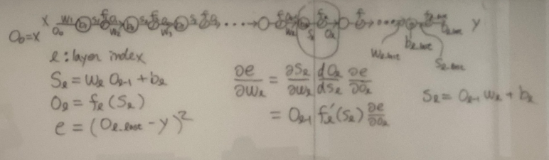

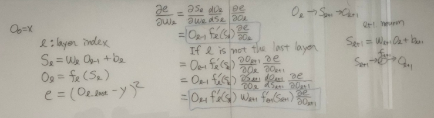

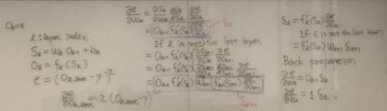

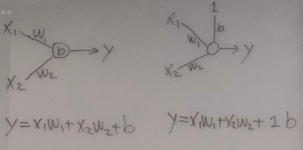

## 다층 FNN 구현 ([code](07%20custom%20FNN%202.py))

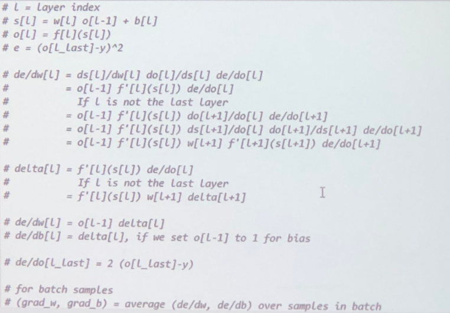

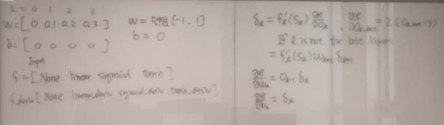

## multi node multi layer ([code](07%20custom%20FNN%203.py))

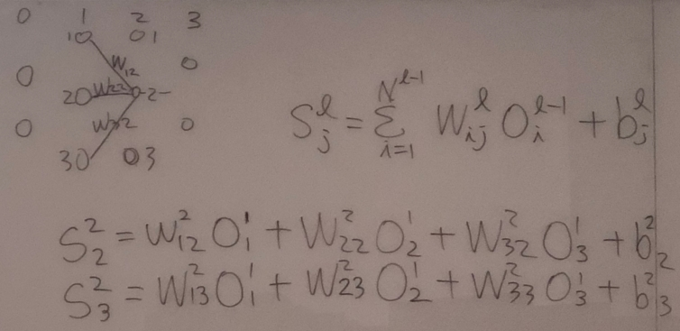

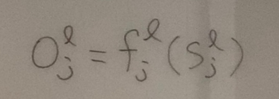

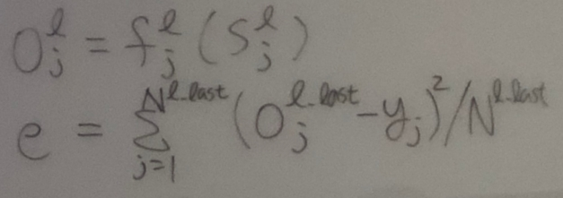

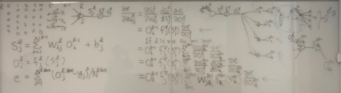

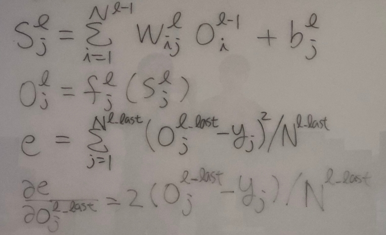

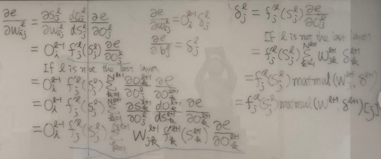

### 수식 정리

$S_j^l = \Sigma_{i=1}^{N^{l-1}} S_{ij}^l O_i^{l-1} + b_j^l$

$O_j^l = f_j^l (S_j^l)$

error는

$e = \Sigma_{j=1}^{N^{l\_last}} (O_j^{l\_last} - y_j)^2 / N^{l\_last}$

$\Large \frac{\partial e}{\partial O_j^{l\_last}} \normalsize = 2 (O_j^{l\_last} - y_j) / N^{l\_last}$

도함수는

$\Large \frac{\partial e}{\partial W_{ij}^{l}} \normalsize = \Large \frac{\partial S_j^l}{\partial W_{ij}^{l}} \frac{d O_j^l}{d S_j^l} \frac {\partial e}{\partial O_j^l}$

$= O_i^{l-1} {f^\prime}_j^l (S_j^l) \Large \frac {\partial e}{\partial O_j^l}$

If l is not the last layer

$= O_i^{l-1} {f^\prime}_j^l (S_j^l) \Large \Sigma_{k=1}^{N^{l+1}} \frac {\partial O_k^{l+1}}{\partial O_j^l} \frac {\partial e}{\partial O_k^{l+1}}$

$= O_i^{l-1} {f^\prime}_j^l (S_j^l) \Large \Sigma_{k=1}^{N^{l+1}} \frac {\partial S_k^{l+1}}{\partial O_j^l} \frac {d O_k^{l+1}}{d S_k^{l+1}} \frac {\partial e}{\partial O_k^{l+1}}$

$= O_i^{l-1} {f^\prime}_j^l (S_j^l) \Large \Sigma_{k=1}^{N^{l+1}} \normalsize W_{jk}^{l+1} {f^\prime}_{k}^{l+1} (S_k^{l+1}) \Large \frac {\partial e}{\partial O_k^{l+1}}$

$\delta_j^l = {f^\prime}_{j}^{l} (S_j^l) \Large \frac{\partial e}{\partial O_j^l}$ 라고 정의하면,

If l is not the last layer

$\delta_j^l = {f^\prime}_{j}^{l} (S_j^l) \Sigma_{k=1}^{N^{l+1}} W_{jk}^{l+1} \delta_{k}^{l+1}$

$= {f^\prime}_{j}^{l} (S_j^l) \ matmul(W_{j}^{l+1}, \delta^{l+1})$

$= {f^\prime}_{j}^{l} (S_j^l) \ matmul(W^{l+1}, \delta^{l+1})[j]$

$\Large \frac{\partial e}{\partial W_{ij}^{l}} \normalsize = O_i^{l-1} \delta_j^l$

$\Large \frac {\partial e}{\partial b_j^l} \normalsize = \delta_j^l$
